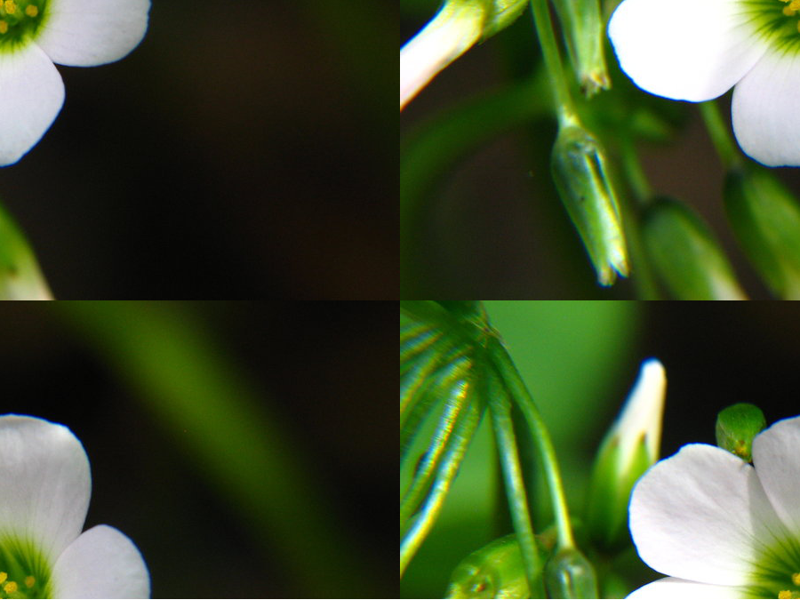

# Usage

python3 image_operations.py filename.jpg

## Program

This program takes an image as input and then performs some operation on the image.

## Operations

**Copy**

**Flip Vertically**

**Flip Horizontally**

**Lighten**

**Darken**

**Horizontall Scroll**

**Vertical Scroll**

**Greyscale**

**Rotate**

**Swap Corners**

**Blur**

**Scale**

